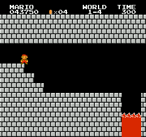

# Evolutionary Strategy

In this repo I tried using Evolutionary Stratgies to train a neural network to play Super Mario Bros. for the NES. The generall approach of this type of machine learning can be found [here](https://openai.com/blog/evolution-strategies/).

## Trainingssession on SuperMarioBros-NES

### Level 1-1 ✔/✔

|[Training 28](./session/training28) uses Agent_old (no sprinting)|[Training 42](./session/training42) uses the (new) Agent|
|---|---|
|||

### Level 1-2 ❌/✔
|[Training 29](./session/training29) uses Agent_old (no sprinting)|[Training 43](./session/training43)  uses the (new) Agent|
|---|---|
|||

### Level 1-3 ❌/✔
|[Training 41](./session/training41) uses the (new) Agent|[Training 44](./session/training44) uses the (new) Agent|
|---|---|
|||

### Level 1-4 ✔
|[Training 45](./session/training45) uses the (new) Agent|
|---|
||

### Level 1-1 and Level 1-2 in one Training ✔
|[Training 48](./session/training48) uses the (new) Agent|From the same Trainingssession|
|---|---|
|||
